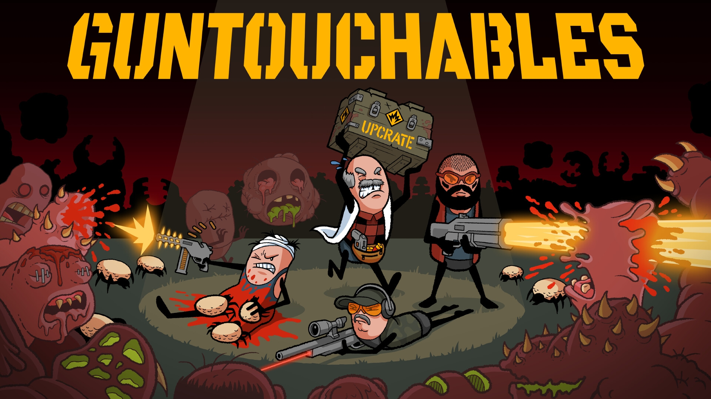
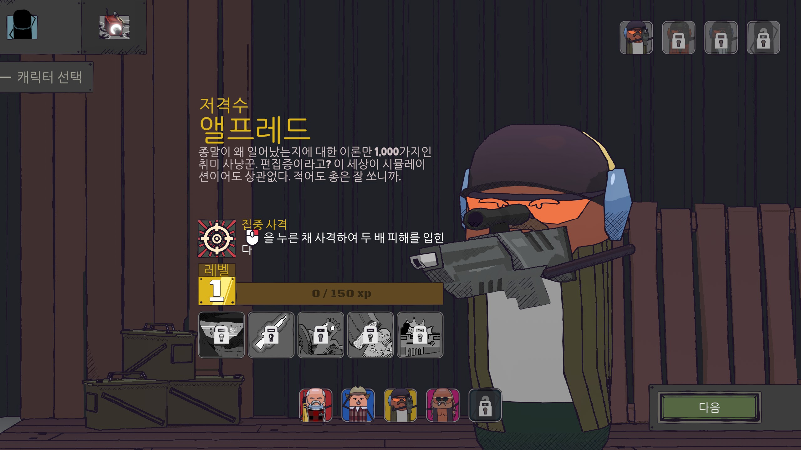
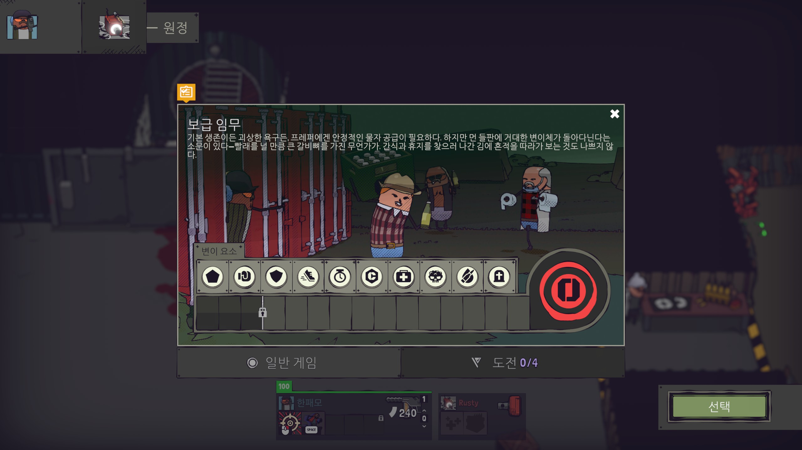
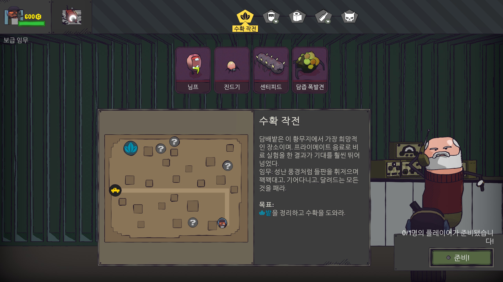
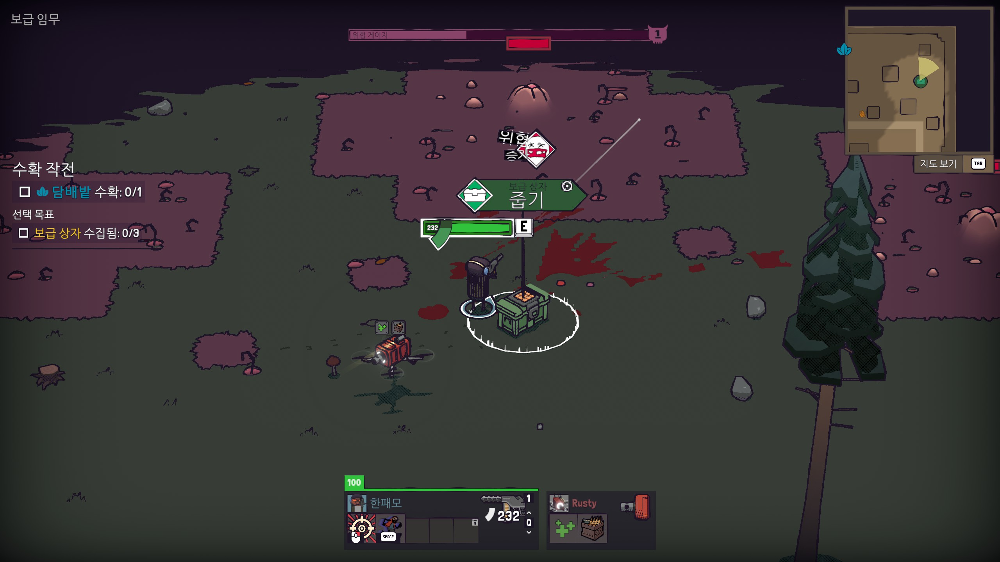
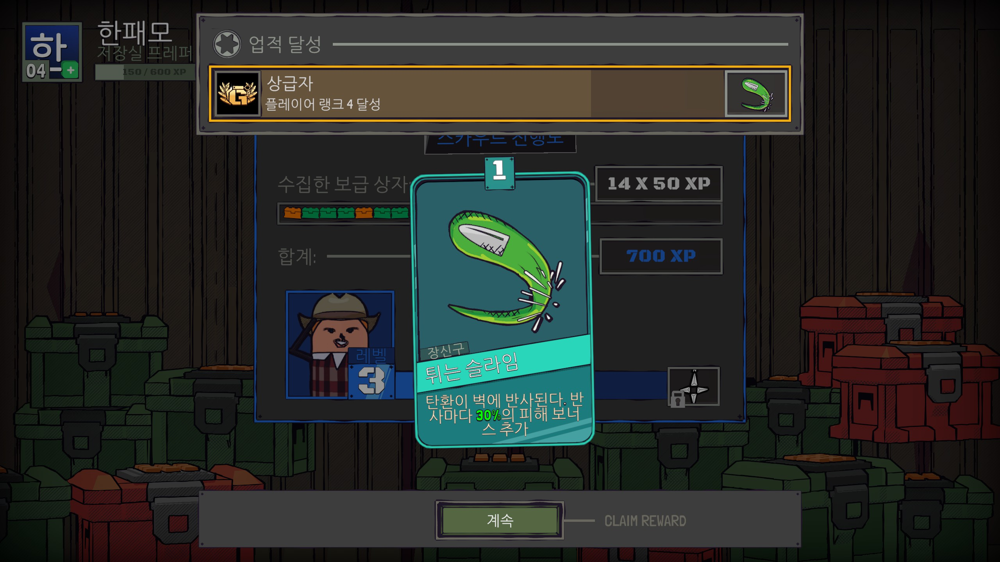

# GUNTOUCHABLES 한글패치 v1.1

> 공식 한국어 지원이 없는 GUNTOUCHABLES의 비공식 한글패치입니다.

---

## 📸 스크린샷

| | |
|---|---|
|  |  |
|  |  |
|  |  |

---

## 📋 번역 범위

| 분류 | 항목 수 | 상태 |
|------|--------|------|
| UI / 시스템 메시지 | 400+ | ✅ 완료 |
| 미션 / 원정 / 챌린지 | 200+ | ✅ 완료 |
| 퍽 / 능력 / 무기 | 350+ | ✅ 완료 |
| 적 / 돌연변이 / 보스 | 150+ | ✅ 완료 |
| 캐릭터 / 벙커 / 업적 | 250+ | ✅ 완료 |
| 미션 설명 / 메타 칭호 | 200+ | ✅ 완료 |
| 튜토리얼 | 22 | ✅ 완료 |
| **합계** | **1,834줄** | ✅ |

---

## 💾 설치 방법

### 필요 조건
- PC (Windows) Steam 버전
- 별도 프로그램 설치 불필요

### 설치 순서

**1단계 — 다운로드**
[Releases](https://github.com/hanpaemo/guntouchables-korean-patch/releases)에서 최신 `GUNTOUCHABLES_KoreanPatch.zip` 다운로드

**2단계 — 압축 해제**
게임 설치 폴더에 **덮어쓰기**로 압축 해제
```
기본 경로: C:\Program Files (x86)\Steam\steamapps\common\GUNTOUCHABLES
```

**3단계 — 게임 실행**
Steam에서 게임 실행 → 설정에서 언어를 **简体中文** 선택

> ⚠️ 중국어 간체 슬롯을 한국어로 교체한 방식입니다. 게임 내에서 简体中文를 선택해야 한글이 표시됩니다.

---

## ❓ 자주 묻는 질문

**Q. 게임 업데이트 후 한글이 안 나와요**

A. Steam이 파일을 덮어쓸 수 있습니다. Releases에서 최신 패치를 다시 설치하세요.

**Q. 글자가 깨지거나 "??"로 나와요**

A. 패치 파일 중 `NanumGothic.ttf`와 `Hanpaemo.GUNTOUCHABLES.ManagedFontPatch.dll`이 `Managed` 폴더에 있는지 확인하세요.

**Q. 멀티플레이에서도 작동하나요?**

A. 네, 패치는 클라이언트 단독 적용이라 다른 플레이어에게 영향 없이 사용 가능합니다.

---

## 📋 변경 이력

**v1.1** (2026-03-22) — 게임 v1.3.2 패치 대응
- 튜토리얼 시스템 22개 키 번역 추가
- 신규 퍽 8개 번역 (배럴 붐, 흡혈 소방관/빙결사, 복제기 MK1/MK2, 번개 장갑, 전기 뱀파이어 등)
- 신규 탄약 퍽 2개 번역
- zh-CN 번들에 미등록된 신규 항목 자동 주입 기능 추가
- 총 1,834줄 번역 (기존 1,796 → +38)

**v1.0** (2026-03-15)
- 전체 1,796줄 번역 완료
- 블랙조크 초월번역 102건
- 카드 설명 간결체 통일

---

## 🔧 기술 정보

- **번역 방식**: Unity Localization zh-CN 슬롯 교체 + Addressables 카탈로그 패치
- **폰트**: 나눔고딕 (NanumGothic) — 런타임 TMP 폴백 주입
- **DLL 패치**: `Assembly-CSharp.dll` — SteamManager.Awake에 폰트 초기화 호출 삽입
- **번역 파일**: `translation/ko/LocalizedStrings_ko.csv`

---

## 📝 오류 제보 / 기여

번역 오류나 누락된 텍스트를 발견하면 아래로 알려주세요:
- **Issues**: [GitHub Issues](https://github.com/hanpaemo/guntouchables-korean-patch/issues)
- **블로그**: https://hanpaemo.blogspot.com

---

## ❤️ 후원

번역이 도움이 되셨다면 응원 부탁드립니다!
- **Ko-fi**: https://ko-fi.com/hanpaemo

---

## 👤 제작

**한패모** — 인디게임 한글패치 모음
- GitHub: https://github.com/hanpaemo
- 블로그: https://hanpaemo.blogspot.com

---

## ⚖️ 라이선스

이 패치는 팬 제작 비공식 번역입니다.
게임 원작의 저작권은 **Blue Wizard Digital**에 있습니다.
상업적 이용을 금지합니다.
